## Aug 30
Vi har vår `docker-compose.yml` och `Dockerfile`. Så nu kör vi 
```
docker compose up -d --build
```
för att skapa containern. De två filerna är kopior av det jag lekt runt med nu i helgen för att bygga en liten foundation i php. Den containern jag använda har jag kört `compose stop` och `compose down` på så att vi kan återanvända container arkitekturen helt på samma ports.  
Detta körs även
```
sudo chown -R $USER:$USER ./html
```
på min Linux maskin för att få ownership över `./html`.  
Output från `docker compose ps` nu:  
```
stevenlomon@steven-pop-os:~/fullstack/fsu-php-assignment$ docker compose ps
NAME                              IMAGE                  COMMAND                  SERVICE      CREATED          STATUS          PORTS
fsu-php-assignment-db-1           mariadb:10.6           "docker-entrypoint.s…"   db           45 seconds ago   Up 44 seconds   3306/tcp
fsu-php-assignment-phpmyadmin-1   phpmyadmin             "/docker-entrypoint.…"   phpmyadmin   45 seconds ago   Up 44 seconds   0.0.0.0:8081->80/tcp, [::]:8081->80/tcp
fsu-php-assignment-site-1         php-assignment:local   "docker-php-entrypoi…"   site         45 seconds ago   Up 44 seconds   0.0.0.0:8082->80/tcp, [::]:8082->80/tcp
stevenlomon@steven-pop-os:~/fullstack/fsu-php-assignment$
```
Så nu på root @8082 borde vi se...  
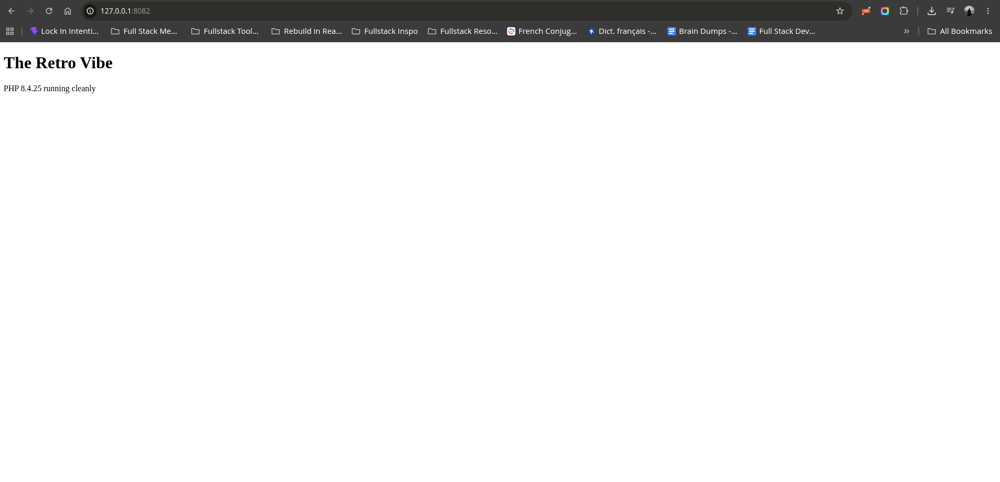  
Wonderful 🥳  

Låt oss nu översätta [vår sitemap från vår pre-work](pre-work.md#sitemap)  
```
/  
/register  
/profile  
/groups  
/groups/:id  
/groups/:id/discussions  
/groups/:id/discussions/:id  
``` 
till en file based router. Precis som Next.js!! Apparently så moderniserade Next.js det som PHP etablerade, riktigt cool dot to connect!  

Och jag märker här haha...  
Min första instinkt var att sätta upp det som vi skulle i Next.js!  
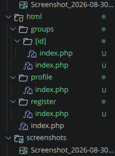  
Men efter att ha bollat lite med AI finns det två stora downsides med detta:  
1. I php kan vi inte använda path aliases som `(@/lib/db)` lika lätt som vi kan i Next.js  
2. I Gemini's ord:  
> Flat files (groups.php, group.php, topic.php, register.php, login.php) align with how Apache natively routes requests and keep your require statements simple.  

Så vi the Flat Script Files (`/groups.php`, `/topics.php`) approach istället för the Nested Directory (`/groups/index.php`, `/topics/index.php`) approach! Vilket betyder att vår sitemap helt enkelt översätts till
```
html/
├── db.php
├── index.php
├── register.php
├── login.php
├── profile.php
├── groups.php
└── group.php
```
detta!  
Det som jag från Next.js tänker `/html/groups/[id]/index.php` blir helt enkelt `/group.php?id=id`!  

Oxå; i och med att detta inte är Next.js och vi inte kan tänka komponent vis och hålla state lätt..  
> Tänker något sånt här med login i Navbar samt ett knapp för att bli medlem haha:  
> 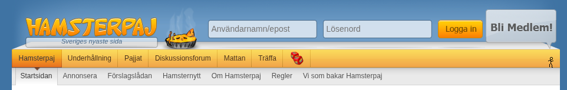  

Jag tar tillbaka detta, jag vill bara att arkitekturen ska vara så simpel som bara möjlig med så lite head ache som bara möjligt haha.  

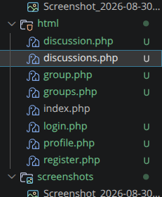  
Så där har vi nu istället då!  

Vår `db.php` som innehåller vår databaskoppling ligger i `/html/` istället för root för att... pga hur vår Docker container är uppsatt om jag förstår rätt. Men den representerar inte en sida alls.  

Nu när jag håller på att be Gemini översätta min ERD till SQL pekar den ut en väldigt valid point:  
> reply_to Reference: In the diagram, reply_to links to User(UniqueID). If you meant for replies to reference the parent post instead (for threaded comment trees), change that foreign key to FOREIGN KEY (reply_to) REFERENCES posts(id) ON DELETE SET NULL.  

Det är smidigare att `reply_to` är en self-referential FK till en `Post` eller `NULL` för vi kan hitta `User` via `Post`!  
Så vår nya ERD..  
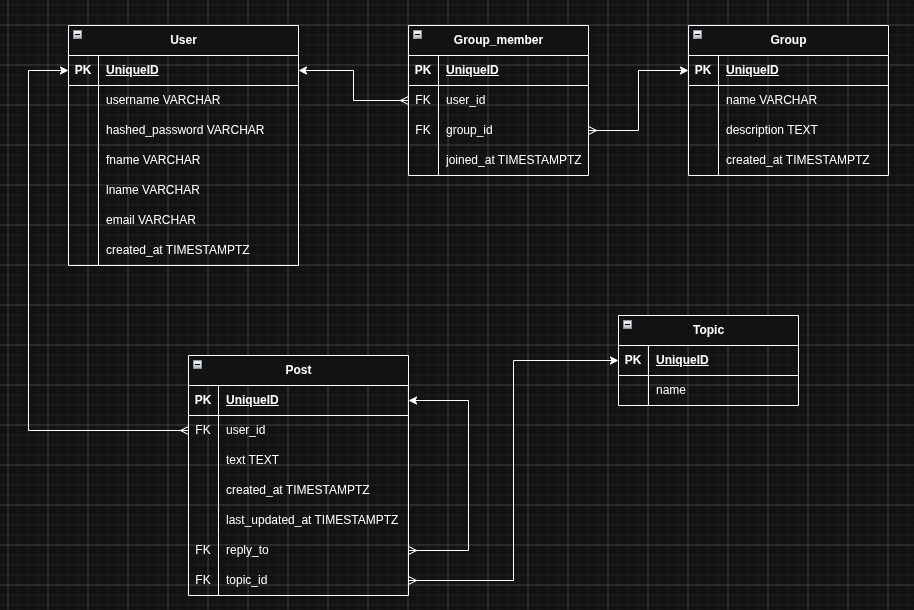  
There we go.  

Och detta finns nu översatt till SQL i denna [schema.sql fil](./db/schema.sql). Dags att köra det i phpMyAdmin.  
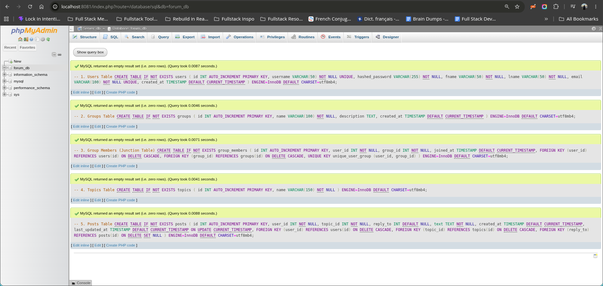  
Ser lovande ut! Och...  
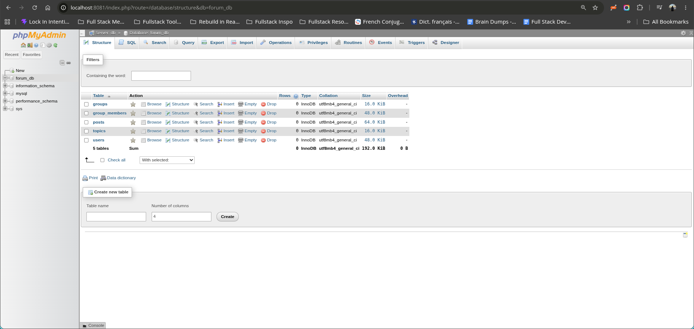  
Snyggt 🥳  

## Sep 1
Kodade inte på detta alls igår, oh well! Ska få till lite nu iaf.  
Jag är på the Home page. Från den ska vi länka till:  
* groups.php  
* register.php
* login.php
* profile.php

Let's tackle register!  
Det känns som att jag har tappat lite vanilla HTML från att ha suttit så mycket med React och Next.js haha. `<form action="">` Vilket `action` vill vi ha här? Det här.. ska ju kommunicera med vår databas. Jag tror jag kommer skippa all validering och nu bara fråga AI hur jag fångar form data och får in det i min databas.  
"Can you give a few hints to kickstart my intuition?" Tänker skriva till Gemini så här nu i början så mycket jag kan så att jag lär mig så php så djupt som möjligt. Men från first principles! Och det är aldrig time wasted för jag kommer kunna connect dots och compare and contrast när jag går tillbaka till TS och Next.js!  

> To make the mental shift from React/Next.js, remember that HTML forms work natively without useState, onChange, or fetch(). The browser itself packages the input fields and sends them directly to PHP.

> **The 3 HTML Fixes (Unlearning Reactisms)**
> 
> Your form needs three essential adjustments before PHP can read any data:
> 
> - **The `name` Attribute:** In vanilla HTML/PHP, `id` is only for CSS/JS. PHP populates `$_POST` strictly based on the **`name`** attribute: `<input name="username">` $\to$ `$_POST['username']`.
>     
> - **The Method & Submit Button:** Specify `method="POST"` on the form and add a `<button type="submit">`.
>     
> - **HTML Structure:** In HTML, `for` is used instead of JSX's `htmlFor`, and all visible elements must sit inside `<body>`, not `<head>`.

Off to a flying start haha!  

Jag märker nu oxå, och ställde frågan. Jag förstår det som att register.php skickar en POST request.. till sig själv?? It kinda does!

> **Next.js vs. Plain PHP Comparison**
> 
> - **Next.js:** You typically create a UI component in `page.tsx` and post data to a separate `route.ts` API endpoint or invoke a Server Action.
>     
> - **Plain PHP:** `register.php` handles both serving the UI and processing the mutation in one cohesive script.  

Interesting!

Lite ändringar här i och med `if ($_SERVER['REQUEST_METHOD'] === 'POST')` satsen och databaskopplingen:  
* Skippar email i register form. Det sätts på profile.php istället. Användare kommer logga in enbart med username och password
* fname och lname är nu båda nullable i databasen så att de sätts till `NULL` i vår POST request, inte ''. `NULL` är mer true  

Let's try it!  
`Fatal error: Uncaught mysqli_sql_exception: Column 'email' cannot be null in /var/www/html/register.php:17 Stack trace: #0 /var/www/html/register.php(17): mysqli->query('INSERT INTO use...') #1 {main} thrown in /var/www/html/register.php on line 17`
Whoops.  
* email är oxå nullable nu haha!

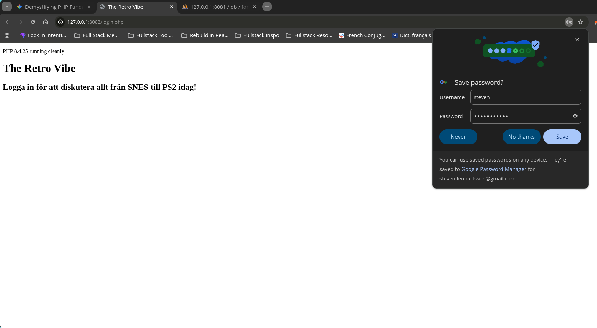  
Succesfully redirected till login.php!  

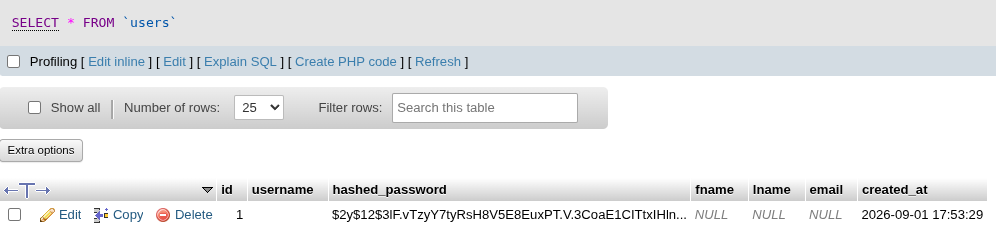  
Och vi har data i databasen!! Men inte username? Det här blir att utreda imorn, I'm gonna call it a day here! Viktiga reps idag  

## Sep 4
Let's investigate varför username inte sparas i databasen.  
```
$username = trim($POST['username'] ?? ''); //TODO: Varför blir denna tom i databasen?
$password = trim($POST['password'] ?? '');
```  
Tänk vad nyttigt det är att ta ett steg bort från koden och komma tillbaka med fräscha ögon. Jag kör ju med `$POST`, inte `$_POST` haha! Det här är most likely felet. Let's fix it and try again..  
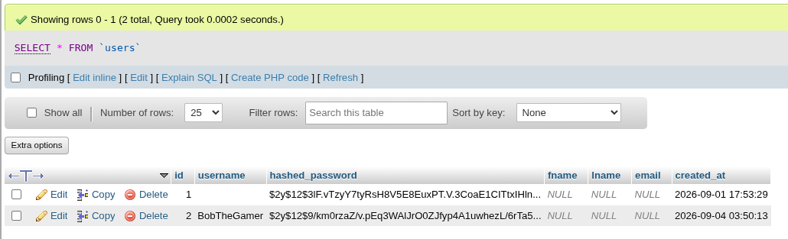  
Let's go. Moving on!  

Efter en liten refactoring detour med `includes/` och `htmlspecialchars()` integrerad nu tänker jag att jag uppdaterar både databasen och `register.php` att faktiskt fånga email, first name och last name nu. Lite mer friction vid registrering men då skipper vi en onödig database call i profile.php bara för att komplettera användar datan + garanterar G kraven.  

"Fatal error: Uncaught mysqli_sql_exception: You have an error in your SQL syntax; check the manual that corresponds to your MariaDB server version for the right syntax to use near '@gmail.com, '$2y$12$epevwY5QjD8OY9LOCgDla.72x7MZYgbgMZLx2d0oO5pHdPpVFGxHS', S...' at line 2 in /var/www/html/register.php:23 Stack trace: #0 /var/www/html/register.php(23): mysqli->query('INSERT INTO use...') #1 {main} thrown in /var/www/html/register.php on line 23" Hmmmmm. Error:n hintar till ett syntax error som jag.. inte ser alls.  
Är det något speciellt jag missar när det kommer till emails? "check the manual that corresponds to your MariaDB server version for the right syntax to use near '@gmail.com, '$2y$12$epevwY5QjD8OY9LOCgDla.72x7MZYgbgMZLx2d0oO5pHdPpVFGxHS'" Tänker speicellt detta. Let's ask AI.  

Right. `VALUES ('$username', $email, '$hashedPassword', $firstName, $lastName)";` Vi måste wrap resten av variablerna i `' '` enkelfnuttar oxå!  
Sen skriver såklart Gemini om hur osäker denna DB INSERT är i och med att prepared statements inte används. Det blir nästa commit.  
Nu funkar det igen! Och ALL user data är i databasen! 🥳 Let's upgrade till prepared statments. Efter det lägger vi till input data validation.  

"Efter det lägger vi till input data validation." On second thought, nah. Jag har gjort detta i mina fundamentals drills, jag vet hur det funkar, och vill behålla momentum och sharpen my other fundamentals. Let's move on till vår login form.  

Login form.. helt implementerat vill jag säga! Många security best pracices implementerade plus att jag får solidify och crystallize min förståelse för PRG och $_SESSION!  

För att solidify och crystallize vår register to login flow:  
* Vi navigerar till register.php som browsern ger oss via GET
* Vi fyller i formuläret och trycker Skicka
* register.php skickar en POST request till sig själv och validerar datan
* Om datan är valid gör den en redirect till login.php som browsern ger oss via GET
* Vi fyller i detta formulär och trycker Logga in
* login.php skickar en POST request till sig själv och validerar datan
* Om datan är valid gör den en redirect till index.php som browsern ger oss via GET
Alright. Alright, alright. Det är väldigt annorlunda från Next.js!! Men jag gillar det!  

Och auth blir så simpelt som att kolla så att user ID finns i vår $_SESSION superglobal! Och vi kan skriva en helper function i helpers.php för detta.  
Jag tänker ju nu dock.. det är egentliga bara profile. php som är den enda hela sidan som ska vara auth skyddad. Man ska 10000% kunna surfa runt på index.html och kolla vilka grupper som finns att gå med i utan att skapa en användare och logga in. Snarare är det ju *funktionalitet* och vissa *sektioner* av web appen som ska vara auth skyddade. Let's brain dump it all out:
* Välkomstmeddelande på index.php
* Gå med i grupper
* Skapa och svara på inlägg
But that's it, right? Jag tror det. Men require_auth() är en start iaf.  

Jag tänker nu oxå. Kan vi inte skapa en is_logged_in() function som ger en boolean. Och så kör vi bara if satser med t.ex
```
<?php if($isLoggedIn): ?>
  <p style="color: red;"><?= e($successMessage) ?></p>
<?php endif; ?>
```
med en else?  

Vi behöver en logout oxå haha! Där logiken rimligtvis skulle vara:  
isLoggedIn -> Logout button  
!isLoggedIn -> Login form/knapp  

Alright, allt kring auth implementerat! Med validation kvar bara att komma tillbaka till, hittills har jag bara 100% kört happy path haha.  

Jag vill tackla groups.php! Här tänker jag att vi kommer använda `foreach:` control structure! Så nånting i stil med
```
<?php foreach($group of $groups): ?>
  <div>
    <h2>$group->title</h2>
    <p>$group->description</p>
  </div>
<?php endforeach; ?>
```
Och för $groups.. om jag förstår rätt så var inte Next.js först alls med SSR, php kom före med det! Så vi borde kunna hämta ut alla grupper ur databasen, lagra det i en variabel $groups, allt på servern, och sen använda det för att skriva ut HTML för klienten! Jag ska bekräfta detta med Gemini  

Yeah!  
> Your understanding of SSR is 100% accurate—PHP was doing Server-Side Rendering three decades before Next.js popularized "React Server Components." In PHP, every page is rendered entirely on the server into pure HTML before a single byte reaches the browser.  
Jag har bara lite syntax grejor jag behöver tänka på i implementeringen nu av groups.php  

`<?php foreach ($groups as $group): ?>` Den här syntaxen... förvirrar mig jättemycket hahaha. Känns inte intuitiv alls  

"Fatal error: Uncaught Error: Undefined constant "MYSQL_ASSOC" in /var/www/html/groups.php:15 Stack trace: #0 {main} thrown in /var/www/html/groups.php on line 15" Hmmmm. Måste vi importera denna? Gemini säger...  
> Change MYSQL_ASSOC to MYSQLI_ASSOC (with an I).  
Simpelt haha!  
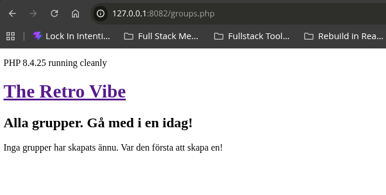  
Och om jag seed:ar vår databas med några grupper via phpMyAdmin och laddar om sidan nu...  
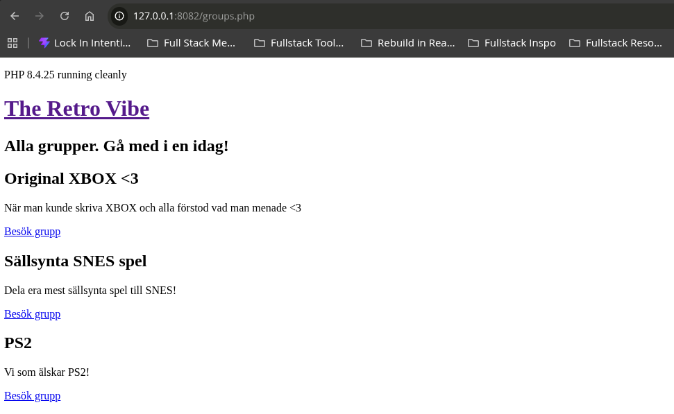  
Let's go 🥳🥳  

## Sep 5
Nästa massive lever-moving steg vi skulle ta är... definitivt i grupperna. Inom nästa två timmarna ska man kunna gå med i grupper. Det första jag vill göra är att ändra group.php så att istället för att den skriver ut "Samlingssida för grupp med id #3" skriver den ut namnet.  
Vi har id:t, nu kan vi göra en lookup med hjälp av id:t för att hitta den matchande gruppen i databasen, spara det i en variabel $group och därifrån få `name` och `description`! Let's do this now. Det börjar med att vi importerar `db` in till group.php!  

> You do not need to cast the integer to a string. MySQLi natively supports integers using the "i" type flag.  
> **MySQLi Type Specifiers**  
> - **`i`**: integer  
> - **`s`**: string  
> - **`d`**: double / float  
> - **`b`**: blob (binary data)  
Bra att veta!  

```
$group = $result->fetch_assoc();

// Nu med $group kan vi istället för $groupId använda..
$subheader = "Samlingssida för " . $group['name']; // String concatenation med `.`!
```
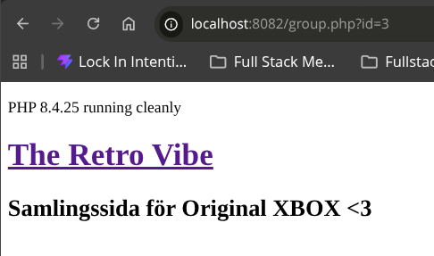  
Helt dynamiskt via id:t i URL:en. Fan va satisfying!! 🥳  

På samlingssidan tänker jag åtminstone:  
* Antalet gruppmedlemmar (`COUNT` på `group_members` tabellen vilket skulle kräva nån typ av JOIN)  
* Knapp för att ansöka medlemsskap  

Knappen för att ansöka om medlemsskap.. visst skickar den en POST request för en ny rad i `group_members` med `status: pending`? På tal om det..  
```
ALTER TABLE group_members 
ADD COLUMN status ENUM('pending', 'approved') NOT NULL DEFAULT 'pending' 
AFTER group_id;
```
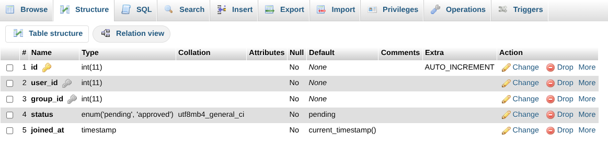  
There we go. Om vi kollar på denna tabell for a few moments..  Jag måste göra så att `joined_at` kan är nullable. Jag tänker att när man ansöker om medlemskap är denna null. Och the moment `status` ändras från `pending` till `approved` (via en PATCH request) fångar vi timestamp och det blir `joined_at`. Ska bolla detta med Gemini men det låter rimligt.  

Okej, väldigt mycket nyttigheter här.  
> Your database logic here is spot-on: someone in pending status has applied, not joined. Having a timestamp in joined_at while status = 'pending' is misleading.  

> The "Ansök" Button MUST Be a POST Request
> Applying to a group mutates data in the database, so it must never be a plain `<a>` link (which issues a safe, cacheable GET).
> Use a compact form with a hidden input for the target group:
> ```
> <form method="POST" action="/apply_group.php">
>   <input type="hidden" name="group_id" value="<?= (int)$group['id'] ?>">
>   <button type="submit">Ansök om medlemskap</button>
> </form>
> ```
> The handler (apply_group.php) runs require_auth(), grabs $_SESSION['user_id'] and $_POST['group_id'], and performs the insert with status = 'pending'.

> Note on "PATCH" Requests in Plain PHP
> In pure Server-Side Rendered (SSR) web applications, standard HTML forms only support GET and POST:
> `<form method="PATCH">` is not valid HTML and will simply default back to a GET request in the browser.
> Because you aren't using JavaScript fetch() or React, your approval action will simply be another standard POST form that follows the PRG pattern  

Alright! Mycket att ta in på en gång men vi tar det steg för steg för steg! Nästa steg:  
```
ALTER TABLE group_members 
MODIFY joined_at TIMESTAMP NULL DEFAULT NULL;
```
Och sen tacklar vi "Ansök om medlemskap" knappen  

Jag körde precis SQL query:n och tänker.. ska vi ha en till timestamp? `applied_at`? Känner nästan det. Ska bolla.  
```
ALTER TABLE group_members 
ADD COLUMN applied_at TIMESTAMP DEFAULT CURRENT_TIMESTAMP 
AFTER status;
```
Vi kör på det!  

Det här...
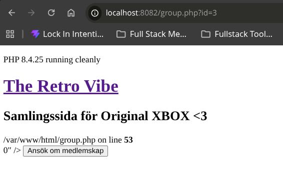  
..ser inte korrekt ut alls haha. I must be missing something.  
> Because id was never fetched from MariaDB, $group['id'] does not exist.  
Right. Men då kör vi med $groupId bara! Det är lika korrekt skriver Gemini nu och nu har vi en knapp!  
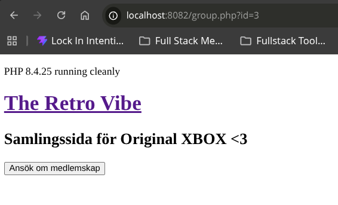  

apply_group.php nästa!  