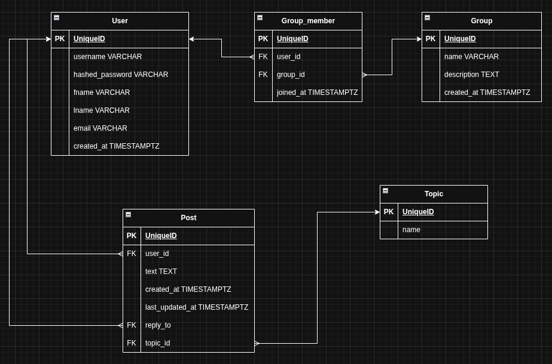

Jag kommer inte göra jättemycket pre-work för denna. Men lite iaf.  
Jag tänker ett Reddit liknande community forum för att diskutera retro TV-spel.  

## ERD
Jag kommer att "make ERD up as I go" lite men som en absolut foundation tänker jag nånting i följande stil.  
Tables:
* `User`
* `Group`
* `Group_member`
* `Topic`
* `Post`

  

Vi skulle kunna ha en Auth table för lösenords hash men jag lagrar `hashed_password` i User istället. En uppgradering från förra inlämningsuppgiften iaf där jag lagrade det ohashade lösenordet direkt i dess `User` table haha.  
Som jag skrev även där, jag har implementerat ordentlig Auth med `jwt`, hashing etc för Florilegium: https://github.com/stevenlomon/florilegium/blob/main/src/app/api/login/route.ts  

## Sitemap
Supersnabb sitemap som är very subject to change:  
/  
/register  
/profile  
/groups  
/groups/:id  
/groups/:id/discussions  
/groups/:id/discussions/:id  

Border räcka? 

Tänker något sånt här med login i Navbar samt ett knapp för att bli medlem haha:  
  
